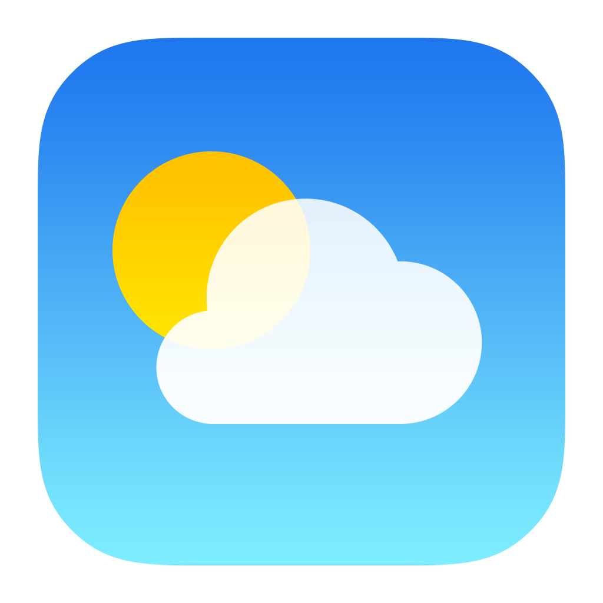

# 🌦 Forecaster

<div align="center">

### Modern Weather Forecast Application Built with Flutter

Real-time weather forecasting application powered by **Flutter**, **Firebase Authentication**, **OpenWeather API**, and **Location Services**.

<p>


</p>

</div>

---

# 📖 Overview

**Forecaster** is a modern Flutter weather application that provides real-time weather information, hourly forecasts, and 5-day weather predictions using the OpenWeather API.

The application offers an intuitive user interface, GPS-based weather detection, Google Authentication, pinned cities, weather notifications, and beautiful weather animations to help users stay informed about current and future weather conditions.

Designed with a clean architecture and responsive UI, Forecaster delivers a smooth and engaging user experience across Android devices.
<p align="center">
  
</p>
<p align="center">
  
</p>
---

# ✨ Features

## 🚀 Onboarding

- Beautiful Splash Screen
- Animated Get Started Screen
- Modern UI
- Smooth Transitions

---

## 🔐 Authentication

Secure login system powered by Firebase.

Features include

- Google Sign-In
- Email Login
- Email Registration
- Secure Authentication
- User Session Management

---

## 🌍 Home Screen

The home screen provides instant access to weather information.

Features

- Current Weather
- Search Any City
- GPS Location Detection
- Temperature
- Humidity
- Wind Speed
- Visibility
- Pressure
- Sunrise & Sunset

---

## 🔍 Search Cities

- Search Worldwide Cities
- Instant Weather Results
- Recent Searches
- Easy Navigation

---

## 📍 Current Location

Automatically detect the user's location.

Features

- GPS Locator
- Current Weather
- Automatic Location Updates
- Permission Handling

---

## 🌦 Weather Forecast

Comprehensive forecasting features include

- Hourly Forecast
- Next 24 Hours
- 5-Day Forecast
- Weather Conditions
- Rain Probability
- Wind Forecast

---

## 📌 Pinned Cities

Quickly access your favorite locations.

Features

- Save Favorite Cities
- Remove Cities
- One-Tap Weather Access
- Persistent Storage

---

## 🔔 Notifications

Stay updated with weather alerts.

Features

- Weather Notifications
- Daily Forecast Alerts
- Notification Settings
- Custom Preferences

---

## 👤 User Profile

Manage application preferences.

Features

- User Information
- Notification Management
- Theme Settings
- Temperature Unit
- Current Location Preferences

---

## 📶 Offline Detection

The application intelligently detects internet connectivity.

Features

- No Internet Screen
- Retry Connection
- Offline Experience

---

# 🌤 Weather Information

The application displays

- Current Temperature
- Feels Like
- Maximum Temperature
- Minimum Temperature
- Humidity
- Wind Speed
- Visibility
- Pressure
- UV Index
- Sunrise
- Sunset
- Weather Description

---

# 🛠 Tech Stack

| Technology | Purpose |
|------------|---------|
| Flutter | Mobile Development |
| Dart | Programming Language |
| Firebase Authentication | User Authentication |
| OpenWeather API | Weather Data |
| GPS / Location Services | Current Location |
| Lottie Animations | Weather Animations |
| Material Design | UI Design |

---

# 🏗 Application Architecture

```text

                 Forecaster

                      │

             Authentication

                      │

      ┌───────────────┴───────────────┐

      │                               │

 Google Login                 Email Login

                      │

                 Home Screen

                      │

        ┌─────────────┼──────────────┐

        │             │              │

   Search City    GPS Location   Pinned Cities

        │             │              │

        └─────────────┼──────────────┘

                      │

              OpenWeather API

                      │

          Hourly & 5-Day Forecast

                      │

             Notifications & Profile

```

---

# 📂 Project Structure

```text
lib/

├── constants/
├── models/
├── providers/
├── services/
├── screens/
│   ├── splash/
│   ├── onboarding/
│   ├── auth/
│   ├── home/
│   ├── search/
│   ├── weather_details/
│   ├── pinned/
│   ├── profile/
│   ├── notifications/
│   └── no_internet/
│
├── widgets/
├── utils/
└── main.dart
```

---

# 📁 Assets

```
assets/

├── fonts/
│   └── Abel-Regular.ttf
│
├── images/
│   ├── cloud.png
│   ├── dew.png
│   ├── heavy-rain.png
│   ├── drop.png
│   ├── eye.png
│   ├── google.png
│   ├── info.png
│   ├── contrast.png
│   ├── weather_icons...
│   └── app_icons...
│
├── animations/
│   ├── cloud.json
│   ├── arrow_animation.json
│   └── hand_animation.json
```

---

# 📱 Screens

- Splash Screen
- Get Started
- Login
- Signup
- Home
- Weather Details
- Search City
- Pinned Weather
- Notifications
- User Profile
- No Internet

---

# 🚀 Getting Started

Clone Repository

```bash
git clone https://github.com/probnk/forecaster.git
```

Navigate

```bash
cd forecaster
```

Install Packages

```bash
flutter pub get
```

Run

```bash
flutter run
```

---

# 🔑 Environment Variables

Create a `.env` file

```env
OPENWEATHER_API_KEY=

FIREBASE_API_KEY=

GOOGLE_MAPS_API_KEY=
```

---

# 📊 APIs Used

- OpenWeather API
- Google Location Services
- Firebase Authentication

---

# 🎯 Learning Objectives

This project demonstrates

- Flutter Development
- REST API Integration
- Firebase Authentication
- GPS Location Services
- JSON Parsing
- Responsive UI Design
- Weather Forecast Visualization
- State Management
- Lottie Animations

---

# 🛣 Future Improvements

- Weather Radar
- Air Quality Index
- Multiple Weather Providers
- Widget Support
- Apple Sign-In
- Weather Maps
- Severe Weather Alerts
- Smart AI Weather Assistant
- Multi-language Support
- Dark Mode

---

# 👨‍💻 Developers

- Umar Farooq
- Muhammad Shamir
- Rao Muhammad Mohsin

---

# 📄 Academic Project

MC Lab Project

Department of Computer Science

---

# ⭐ Support

If you like this project, consider giving this repository a **⭐ Star**.

Your support helps improve the project and motivates future development.

---

<div align="center">

### 🌦 Stay Ahead of the Weather

Built with ❤️ using Flutter

</div>
